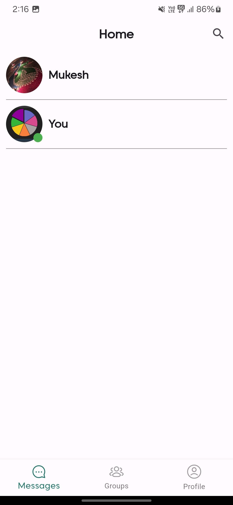
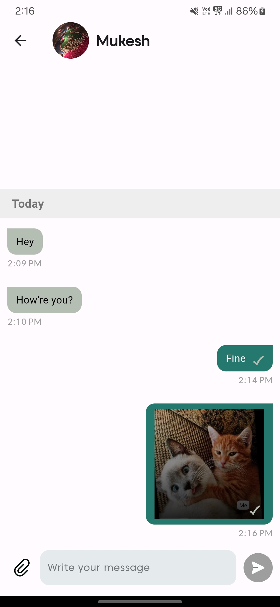
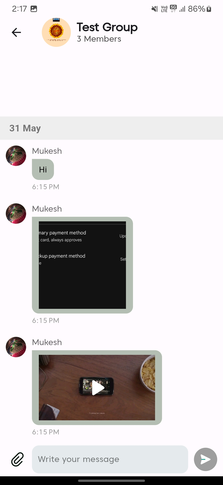
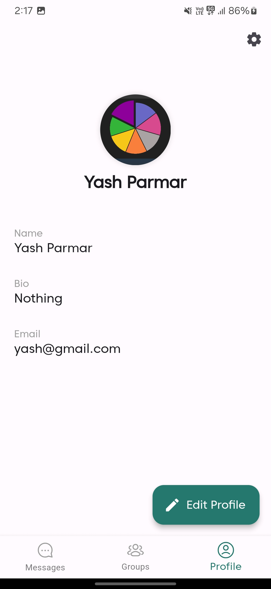

# Chat Box

A real-time chat app that enables seamless messaging and media sharing. Chats and media are stored offline, ensuring users can access their conversations anytime, even without an internet connection.

## Built using

The app is built using [Flutter](https://flutter.dev/) for cross-platform development, [Firebase](https://firebase.google.com/) for backend services, 
and [SQLite](https://www.sqlite.org/) for local storage.

## Features

- [**Real-Time Messaging**](#real-time-messaging)
- [**Group Chats**](#group-chats)
- [**Profile Customization**](#profile-customization)

   ### Real-Time Messaging
    Experience instant and seamless communication with real-time message delivery. Stay connected without delays for a smooth chatting experience.
    

      
      &nbsp;&nbsp;&nbsp;
      
    

   ### Group Chats
    Create and join group conversations to collaborate, share, and stay connected with multiple people at once. Perfect for teams, friends, and family.
    

      
    

   ### Profile Customization
    Set up a personalized profile with your name, photo, and status to share your identity with others in the app.
    

      
    

